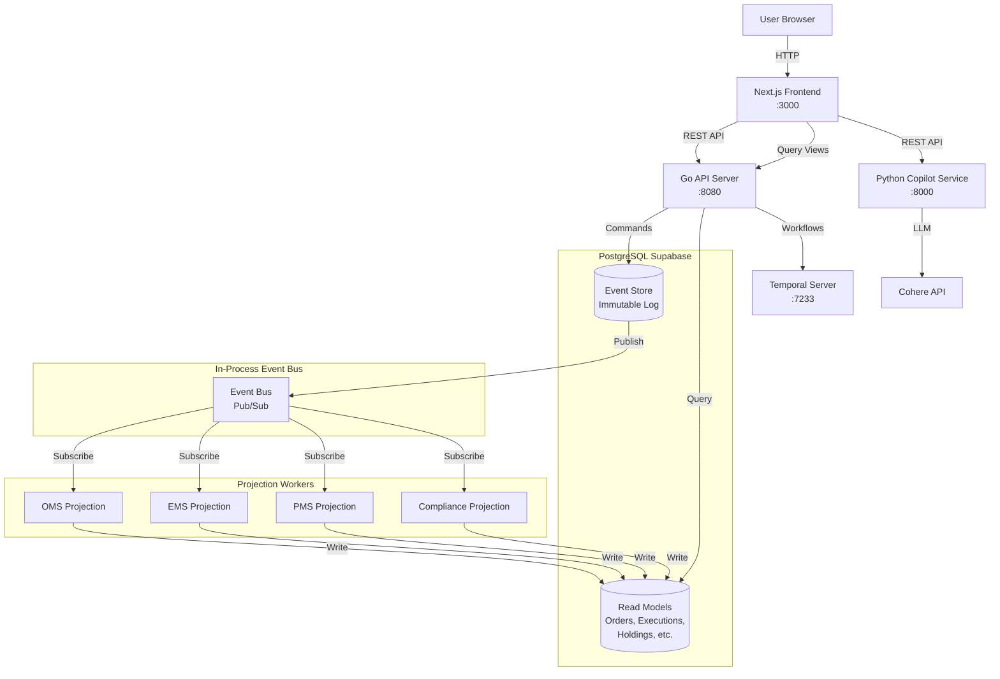
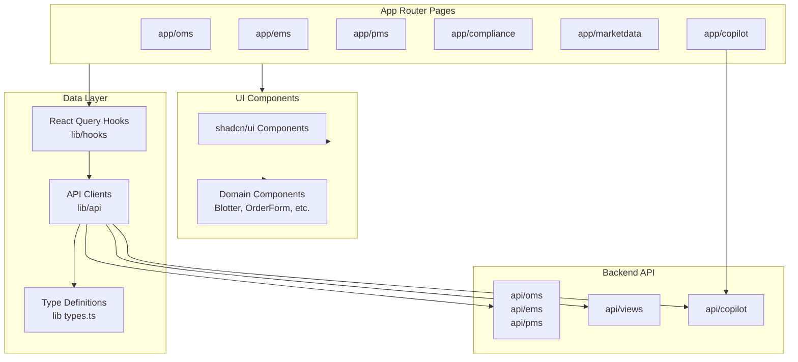
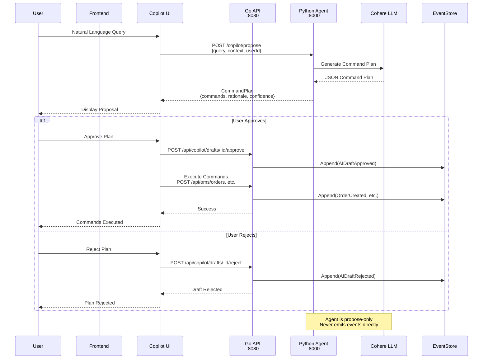

# Instant Architecture Diagrams

## 1. High-Level Systems Design



## 2. User Flow

```mermaid

```

## 3. Backend Diagram

```mermaid
flowchart LR
    subgraph HTTP[HTTP Layer]
        Routes[Gin Router]
        OMSHandler[OMS Handlers]
        EMSHandler[EMS Handlers]
        PMSHandler[PMS Handlers]
        CompHandler[Compliance Handlers]
        MDHandler[Market Data Handlers]
        CopilotHandler[Copilot Handlers]
    end
  
    subgraph Services[Domain Services]
        OMSSvc[OMS Service]
        EMSSvc[EMS Service]
        PMSSvc[PMS Service]
        CompSvc[Compliance Service]
        PricingSvc[Pricing Service]
    end
  
    subgraph EventLayer[Event Layer]
        EventStore[Event Store]
        EventBus[Event Bus]
    end
  
    subgraph Projections[Projection Workers]
        OMSProj[OMS Projection]
        EMSProj[EMS Projection]
        PMSProj[PMS Projection]
        CompProj[Compliance Projection]
    end
  
    subgraph Database[Database]
        EventsTable[(events table)]
        OrdersTable[(orders table)]
        ExecutionsTable[(executions table)]
        HoldingsTable[(holdings table)]
        RulesTable[(rules table)]
    end
  
    Routes --> OMSHandler
    Routes --> EMSHandler
    Routes --> PMSHandler
    Routes --> CompHandler
    Routes --> MDHandler
    Routes --> CopilotHandler
  
    OMSHandler --> OMSSvc
    EMSHandler --> EMSSvc
    PMSHandler --> PMSSvc
    CompHandler --> CompSvc
  
    OMSSvc --> EventStore
    EMSSvc --> EventStore
    PMSSvc --> EventStore
    CompSvc --> EventStore
  
    EventStore --> EventsTable
    EventStore --> EventBus
  
    EventBus --> OMSProj
    EventBus --> EMSProj
    EventBus --> PMSProj
    EventBus --> CompProj
  
    OMSProj --> OrdersTable
    EMSProj --> ExecutionsTable
    PMSProj --> HoldingsTable
    CompProj --> RulesTable
  
    OMSHandler -.->|Query| OrdersTable
    EMSHandler -.->|Query| ExecutionsTable
    PMSHandler -.->|Query| HoldingsTable
    CompHandler -.->|Query| RulesTable
    MDHandler -.->|Query| InstrumentsTable[(instruments table)]
  
    EMSSvc --> PricingSvc
    PMSSvc --> PricingSvc
```

## 4. Frontend Diagram



## 5. Agent Diagram


