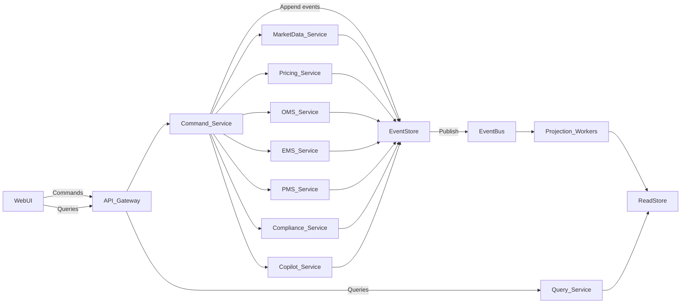

# Instant — Technical Specification

> Scope: **Demo-grade single-tenant system** for **US Treasuries** with **end-of-day (EOD)** market data, **deterministic execution simulation**, and **AI Copilot (propose-only)**.  

> Core premise: **the event log is the system of record**; all UI screens are projections.

---

## 1. Goals / Non-Goals

### 1.1 Goals
- **Event-first correctness**: every meaningful change is an immutable event.
- **Deterministic demo**: same inputs → same outputs (pricing, optimization, execution sim).
- **Cohesive workflows** across **OMS**, **EMS**, **PMS**, **Compliance**, **Analytics**.
- **Explainability everywhere**: compliance decisions, fill prices, pricing inputs, and AI suggestions.
- **Time travel**: “as-of market date” affects evaluated pricing + analytics + what the system “knew”.
- **AI Copilot**: natural language → **draft command plan** → **explicit user approval** → events.

### 1.2 Non-goals (explicit)
- Live trading / dealer connectivity / RFQ.
- Corporates / munis / swaps / multi-currency.
- Real regulatory reporting.
- Real-time market quotes (only evaluated prices from EOD curves).

---

## 2. Product decomposition (Moment-style)

Moment positions OMS and EMS separately; Instant should too:

- **OMS (Order Management System)**: order capture, normalization, lifecycle, allocations intent, compliance gates, approvals, batching.
- **EMS (Execution Management System)**: execution intent routing, deterministic simulation engine, fills, slippage decomposition, execution audit.
- **PMS (Portfolio Management System)**: holdings/cash, targets, optimization, proposals, portfolio analytics.
- **Compliance**: rule authoring, evaluation at pre-trade / pre-exec / post-trade, audit views.
- **Market Data + Evaluated Pricing**: instrument master + curve ingestion + evaluated pricing/risk.
- **Event Studio**: timeline, replay, explainers.

---

## 3. System architecture overview

### 3.1 High-level topology



**Notes**
- For a demo build, the “services” can be modules in one backend, but the boundaries above keep the model clean.
- **EventStore** is source of truth. **ReadStore** is derived.

### 3.2 Command → Event → Projection contract
- **Commands** express intent and are validated synchronously.
- Commands produce **0..N events** (facts).
- Events are appended atomically and then published to the bus.
- Projection workers consume events to build read models.

---

## 4. Data model (Domain + Event sourcing)

### 4.1 Core aggregates

#### Instrument (UST security)
- `InstrumentId` (internal UUID)
- `cusip`
- `type` (bill|note|bond|tips)
- `issueDate`, `maturityDate`
- `coupon` (0 for bills)
- `dayCount`, `couponFrequency`

#### MarketDataDay
- `asOfDate`
- `curvePoints[]` = `{tenor, parYield}`
- `source` metadata (URL/file hash, ingestion timestamp)

#### Order (OMS-owned)
- `OrderId`
- `accountId`
- `instrumentId`
- `side` (BUY|SELL)
- `quantity` (par)
- `orderType` (MARKET|LIMIT|CURVE_RELATIVE)
- `limitPrice?` or `curveSpreadBp?`
- `timeInForce` (DAY|IOC) (demo-limited)
- `state` (DRAFT|STAGED|APPROVAL_PENDING|APPROVED|SENT|PARTIALLY_FILLED|FILLED|CANCELLED|REJECTED|SETTLED)
- `batchId?` (bulk upload grouping)

#### Execution (EMS-owned)
- `ExecutionId`
- `OrderId`
- `fills[]` = `{fillId, qty, price, timestamp, clipIndex}`
- `slippage` = `{bucketSpread, sizeImpact, limitConstraint, total}`
- `explain` = human readable + structured parameters

#### Account / Portfolio (PMS-owned)
- `AccountId`
- `cash`
- `positions[]` = `{instrumentId, quantity, avgCost, marketValueEvaluated}`
- `analytics` = `{duration, dv01, ...}`

#### Proposal (PMS-owned)
- `ProposalId`
- `accountId`
- `asOfDate`
- `trades[]` (normalized OMS order intents)
- `predictedAnalyticsDelta`
- `state` (DRAFT|APPROVED|REJECTED|SENT_TO_OMS)

#### RuleSet (Compliance-owned)
- `RuleSetId`
- `version`
- `rules[]` (typed DSL, see §7)
- `scope` (firmwide|account|desk)
- `effectiveFrom`, `effectiveTo?`

#### Workflow / RoutingPolicy (Automation)
- `RoutingPolicyId`
- `version`
- `policy` (rules-based routing, grouping, approval thresholds)

---

## 5. Event model

### 5.1 Event envelope (required fields)
- `eventId` (UUID)
- `eventType` (string)
- `occurredAt` (timestamp)
- `actor` = `{actorId, role}`
- `aggregate` = `{type, id}`
- `correlationId` (ties a user action/flow together)
- `causationId` (prior event that directly caused this)
- `payload` (typed JSON)
- `explanation?` (string; required for simulation + compliance decisions)
- `schemaVersion` (int)

### 5.2 Canonical event types (by module)

#### Market Data
- `MarketDataCurveIngested`
- `MarketDataAsOfDateSelected`
- `InstrumentIngested`
- `InstrumentUpdated`

#### Pricing (evaluated)
- `PricingInputsResolved`
- `EvaluatedPriceComputed`
- `RiskMetricsComputed`

#### OMS
- `UploadBatchReceived`
- `UploadBatchValidated`
- `OrderCreated`
- `OrderAmended`
- `OrderCancelled`
- `OrderApprovalRequested`
- `OrderApproved`
- `OrderRejected`
- `OrderSentToEMS`

#### Compliance
- `RuleSetPublished`
- `RuleEvaluated`
- `RuleViolationDetected`
- `OrderBlockedByCompliance` (hard)
- `OrderWarnedByCompliance` (soft)
- `ExecutionBlockedByCompliance` (hard)

#### EMS / Execution Simulation
- `ExecutionRequested`
- `ExecutionSimulated`
- `FillGenerated`
- `OrderPartiallyFilled`
- `OrderFullyFilled`
- `SettlementBooked`

#### PMS
- `AccountCreated`
- `PositionUpdated`
- `TargetSet`
- `OptimizationRequested`
- `ProposalGenerated`
- `ProposalApproved`
- `ProposalSentToOMS`

#### Copilot (AI propose-only)
- `AIDraftProposed`
- `AIDraftApproved`
- `AIDraftRejected`

---

## 6. Projections (read models)

### 6.1 Why projections
- UI needs fast queries; event streams are optimized for writes/audit.
- Projections must be **rebuildable** from the event store.

### 6.2 Required projections
- `MarketGridView`: evaluated price/yield/risk by CUSIP (as-of date).
- `BlotterView`: orders with lifecycle state, compliance flags, last fill, PnL estimate.
- `ExecutionTapeView`: fills + slippage decomposition + explanation.
- `AccountPositionsView`: holdings + cash + analytics.
- `ComplianceStatusView`: violations/warnings with rule references and computed metrics.
- `ProposalView`: generated trades + predicted deltas + approval state.
- `EventTimelineView`: per aggregate + per correlationId.

### 6.3 Replay / time-travel
Two independent “time” dimensions:
- **Market time**: `asOfDate` selected (affects pricing inputs).
- **System time**: event replay cutoff (what the system had processed).

Implementation options (demo-friendly):
- **Option A (simple)**: rebuild projections from scratch up to replay cutoff, with a fixed `asOfDate`.
- **Option B (faster)**: periodic projection snapshots + replay deltas.

---

## 7. Compliance rules DSL (typed, explainable)

### 7.1 Rule representation
Rules are stored as data, not code, and evaluated deterministically.

Example (JSON-ish):
```json
{
  "ruleId": "maxDuration",
  "severity": "BLOCK",
  "scope": {"type":"ACCOUNT","accountId":"A1"},
  "predicate": {
    "metric": "portfolio.duration",
    "op": "<=",
    "value": 6.0
  },
  "explainTemplate": "Blocks trades that would increase duration above 6.0y"
}
```

### 7.2 Evaluation points
- **Pre-trade**: on `OrderCreated` / `OrderAmended` → emits warnings/blocks.
- **Pre-execution**: on `OrderApproved` / `ExecutionRequested` → hard gate.
- **Post-trade**: on `FillGenerated` / `SettlementBooked` → audit.

### 7.3 Outputs
Each evaluation emits:
- `RuleEvaluated` with input snapshot (metrics, order, account, marketDate)
- if violated: `RuleViolationDetected` + `OrderBlockedByCompliance` or warn event

---

## 8. OMS vs EMS responsibilities (hard boundary)

### 8.1 OMS (Order Management System)
Owns:
- order capture + normalization (single ticket, bulk upload)
- state machine / approvals / cancels / amendments
- allocations intent (demo: simplified)
- initiating compliance checks (pre-trade)
- sending eligible orders to EMS (`OrderSentToEMS`)

Does NOT own:
- fill logic
- routing/simulation decisions
- slippage decomposition

### 8.2 EMS (Execution Management System)
Owns:
- execution requests, routing policies, deterministic simulation
- fills + clip sizing + delays
- slippage decomposition + explainers
- marking order fill state events (`OrderPartiallyFilled`, `OrderFullyFilled`)

Does NOT own:
- creating/editing order economic terms (except execution constraints like “limit not marketable” handling via events)

---

## 9. Execution simulation (deterministic)

### 9.1 Inputs
- Order: qty, side, type, price intent
- Instrument: maturity bucket
- MarketDataDay: evaluated price/yield inputs for baseline mid
- Liquidity profile table: `bucket -> {spreadBp, maxClip, delayMsPerClip, sizeImpactFn}`

### 9.2 Algorithm (sketch)
1. Determine baseline mid evaluated price for instrument (from pricing service).
2. Compute bucket spread component.
3. Split order into clips of `maxClip`.
4. For each clip:
   - compute size impact deterministically (e.g., linear or piecewise function of clip size)
   - apply side (buy pays up, sell hits down)
   - enforce limit/curve-relative constraints (may reduce filled qty)
   - assign deterministic timestamps (base + `clipIndex * delay`)
5. Emit `ExecutionSimulated` with decomposition + parameters.
6. Emit `FillGenerated` per clip and order-level fill state events.

### 9.3 Explainability contract
Every `ExecutionSimulated` event must include:
- `modelVersion`
- `bucket`, `spreadBp`, `maxClip`, `delayModel`
- `sizeImpactInputs` and outputs
- computed slippage breakdown

---

## 10. Pricing & analytics (EOD evaluated)

### 10.1 Inputs
- `MarketDataDay.curvePoints` (par yields by tenor)
- instrument cashflows

### 10.2 Outputs (minimum)
- clean price
- dirty price
- accrued interest
- yield
- duration + DV01

### 10.3 Labeling
All UI surfaces must label:
- **Evaluated Price**
- **Evaluated Yield**
and show the **as-of date** and curve source.

---

## 11. PMS optimization (demo-credible)

### 11.1 Objective
Generate a Proposal (trade list) to move account toward targets:
- target duration
- bucket weights (coarse)
while minimizing turnover.

### 11.2 Determinism
Optimization must be deterministic (fixed solver seed if any, stable tie-breakers).

### 11.3 Output
`ProposalGenerated` includes:
- proposed trades (in OMS order schema)
- predicted analytics delta
- assumptions (pricing as-of date, constraints)

---

## 12. Copilot (AI propose-only) — technical behavior

### 12.1 Surfaces
- global command bar (“Ask Instant”)
- contextual prompts in OMS/PMS/Compliance screens

### 12.2 Output contract
Copilot returns a **DraftCommandPlan**:
- `commands[]` (typed; e.g., `SetTarget`, `PublishRuleSet`, `CreateOrdersFromCSVText`)
- `expectedEvents[]` (event types it expects to be emitted)
- `rationale` (structured + plain text)
- `assumptions` (explicit)
- `confidence`

### 12.3 Approval model
- Copilot never appends domain events directly.
- When user clicks Approve:
  - emit `AIDraftApproved`
  - run commands through the same validator/executor pipeline as any user action

### 12.4 Audit
Store (at minimum):
- model identifier/version
- prompt hash (store raw prompt optionally; demo can store raw)
- full proposed command plan

---

## 13. API surface (minimal)

### 13.1 Commands (write)
- `POST /commands` with `{commandType, payload, correlationId}`

Examples:
- `CreateOrder`
- `AmendOrder`
- `ApproveOrder`
- `RequestExecution`
- `SetTarget`
- `RunOptimization`
- `PublishRuleSet`
- `CopilotPropose` (returns draft only, no events unless you choose to store `AIDraftProposed`)

### 13.2 Queries (read)
- `GET /views/blotter?asOfDate=YYYY-MM-DD`
- `GET /views/market-grid?asOfDate=...`
- `GET /views/accounts/:id?asOfDate=...`
- `GET /views/proposals/:id`
- `GET /views/compliance?scope=...`
- `GET /events?aggregateType=...&aggregateId=...`
- `GET /events?correlationId=...`

---

## 14. Storage choices (demo-friendly defaults)

### 14.1 EventStore
Pick one:
- **Postgres** append-only table (best demo ROI)
- or **SQLite** for ultra-simple local demo

Schema sketch:
- `events(event_id PK, occurred_at, event_type, aggregate_type, aggregate_id, correlation_id, causation_id, actor_id, actor_role, payload_json, explanation, schema_version)`

### 14.2 ReadStore
- Postgres tables per projection, or a document table keyed by projection name + id.

### 14.3 EventBus
Demo default:
- in-process pub/sub OR Postgres LISTEN/NOTIFY OR a simple queue table.

---

## 15. Demo “credibility checklist” (hard requirements)
- Every screen shows **as-of date** and can open **Event Timeline**.
- Every compliance decision shows:
  - rule version
  - computed metric values
  - pass/fail explanation
- Every execution shows:
  - deterministic inputs
  - slippage decomposition
  - clip sizing + timestamps
- “Replay” can rebuild at least one account + one order flow.

---

## 16. Reference: Moment-grounding (public claims used as inspiration)
These are product-positioning anchors only; Instant intentionally constrains scope (UST-only, EOD data, deterministic sim).
- `https://moment.com/about`
- `https://moment.com/blog/series-b-announcement`
- `https://moment.com/blog/lpl-announcement`
- `https://moment.com/blog/series-a-announcement`
- `https://www.prweb.com/releases/moment-to-modernize-fixed-income-trading-and-scale-execution-capabilities-for-lpl-financial-302499657.html`


